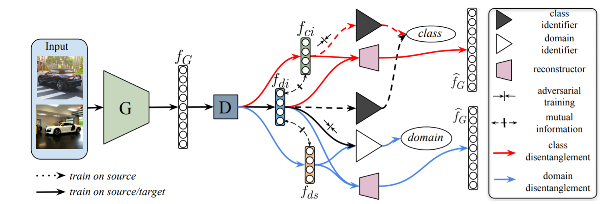

# DAL with disentangled representations


PyTorch implementation for **Domain agnostic learning with disentangled representations** (ICML2019 Long Oral). This repository contains some code from [Maximum Classifier Discrepancy for Domain Adaptation](https://github.com/mil-tokyo/MCD_DA). If you find this repository useful for you, please also consider cite the MCD paper!

The code has been tested on Python 3.6+PyTorch 0.3 and Python 3.6+PyTorch 0.41. To run the training and testing code, use the following script:

```
python main.py --source=mnist --recordfolder=agnostic_disentangle --gpu=0
```

The poster of this paper can be found with the link: [poster](https://cs-people.bu.edu/xpeng/pdfs/DAL_ICML2019_Poster.pdf)

The **Oral** presentation of this paper in ICML2019 can be found with the link: [Oral Presentation](https://slideslive.com/38917425/transfer-and-multitask-learning)

## Citation
If you use this code for your research, please cite our [paper](http://proceedings.mlr.press/v97/peng19b/peng19b.pdf):

```
@InProceedings{pmlr-v97-peng19b,
  title = 	 {Domain Agnostic Learning with Disentangled Representations},
  author = 	 {Peng, Xingchao and Huang, Zijun and Sun, Ximeng and Saenko, Kate},
  booktitle = 	 {Proceedings of the 36th International Conference on Machine Learning},
  pages = 	 {5102--5112},
  year = 	 {2019},
  editor = 	 {Chaudhuri, Kamalika and Salakhutdinov, Ruslan},
  volume = 	 {97},
  series = 	 {Proceedings of Machine Learning Research},
  address = 	 {Long Beach, California, USA},
  month = 	 {09--15 Jun},
  publisher = 	 {PMLR},
  pdf = 	 {http://proceedings.mlr.press/v97/peng19b/peng19b.pdf},
  url = 	 {http://proceedings.mlr.press/v97/peng19b.html},
  abstract = 	 {Unsupervised model transfer has the potential to greatly improve the generalizability of deep models to novel domains. Yet the current literature assumes that the separation of target data into distinct domains is known a priori. In this paper, we propose the task of Domain-Agnostic Learning (DAL): How to transfer knowledge from a labeled source domain to unlabeled data from arbitrary target domains? To tackle this problem, we devise a novel Deep Adversarial Disentangled Autoencoder (DADA) capable of disentangling domain-specific features from class identity. We demonstrate experimentally that when the target domain labels are unknown, DADA leads to state-of-the-art performance on several image classification datasets.}
}
```
